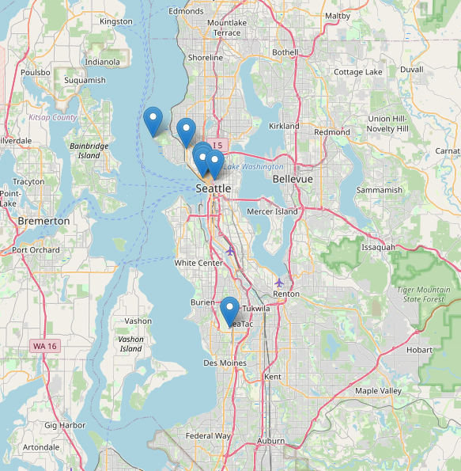

# Check-in


A simple self-hosted check-in app for saving where you have been or favouriting locations.

## Features

- ✅ **Simple web API** to save a longitude, latitude, note and date to a database.  
- ✅ **Map visualisation** see your saved locations plotted on a [leaflet.js](https://leafletjs.com/) map.
- ✅ **SQLite** for lightweight, simple, file-based storage.  
- ✅ **Dockerized** for easy deployment.  

## Using Check-in

### Save a Location

* Endpoint: `POST /checkin`
* Content-type: `application/json`
* Body params: 
  
    | Field       | Type     | Description                                   |
    | ----------- | -------- | --------------------------------------------- |
    | `lat`  | `double`  | Latitude in decimal degrees                   |
    | `long` | `double`  | Longitude in decimal degrees                  |
    | `dateTime`      | `string` | ISO 8601 timestamp (e.g. `2025-05-11T14:30+01:00`) |
    | `note`      | `string` | Text content of the note                      |
* Example request:
    ```bash
    curl -X POST http://localhost:8080/checkin?apiKey=your_api_key \
        -H "Content-Type: application/json" \
        -d '{
            "lat": 50.17479763660827,
            "long": -5.256169543434019,
            "dateTime": "2025-05-11T14:30:00Z",
            "note": "Cornwall!"
        }'
    ```

### Visualise Locations on Map

Once the Docker container is running, go to http://localhost:8080/checkin



## Check-in in from iOS

Instructions coming soon...

Basically you want to use Shortcuts with the  following actions:

* Get current location
* Current Date
* Ask for Text with Note
* Get contents of http://localhost:8080/checkin?apiKey=your_api_key

With the above actions, you then have enough data to [send a POST request to the API](#save-a-location), which can be done in the 'Get contents of' advanced options.

The advantage of using a Shortcut is you can place a shortcut on a home screen, or in the action centre.

## Database

You can find a blank SQLite database [here](./db_empty.db).

Make sure you copy `db_empty.db` to the right place and update the `docker run` command / Docker Compose config accordingly.

## Docker Usage

### Docker Run

```bash
docker run \
  -d \
  -p 8080:8080 \
  -v ./checkin_data/db.db:/data/db.db \
  -e CHECKIN_API_KEY="your_api_key" \
  cwndev/checkin:latest
```

### Docker Compose

```
services:
  checkin:
    image: cwndev/checkin:latest
    container_name: checkin
    restart: always
    environment:
      - CHECKIN_API_KEY=your_api_key
    ports:
      - 8080:8080
    volumes:
      - ./checkin_data/db.db:/data/db.db
```